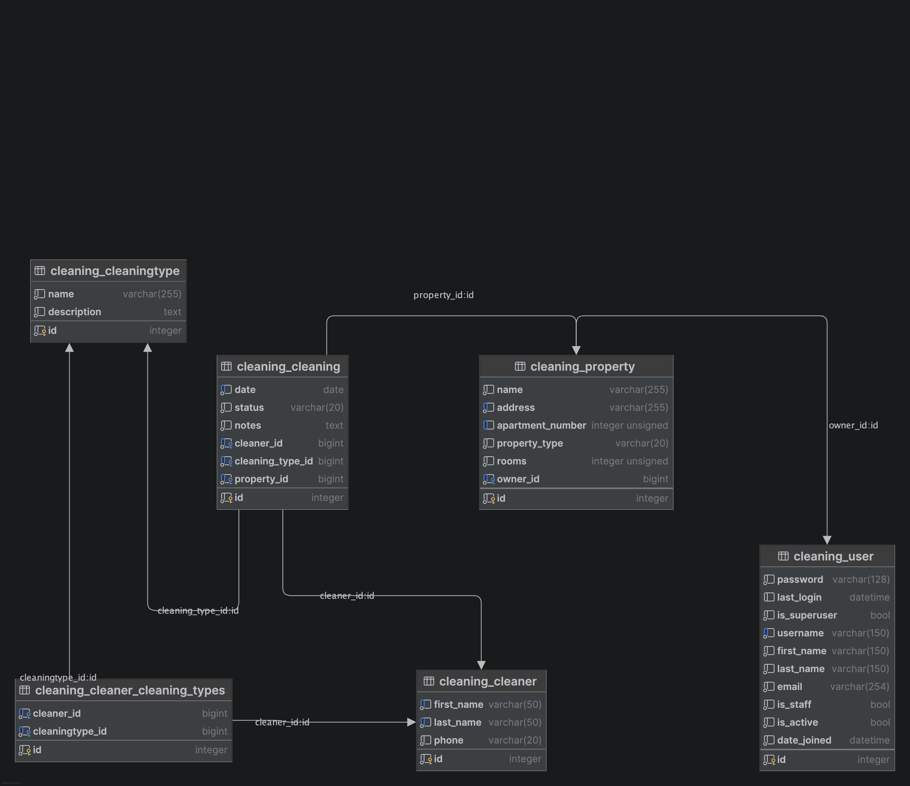

# Cleaning Service

## About the project

Cleaning Service is a web application for managing cleaning services.

The application allows users to manage properties, cleaners, cleaning types, and cleaning tasks. 
Users have different roles with different access levels to the system.

## Features

- User authentication and registration
- Role-based access control
- Property management
- Cleaner management
- Cleaning type management
- Cleaning management
- Search and filtering
- Pagination
- Django admin panel
- Responsive user interface

## Technologies

- Python 3.14
- Django 6.1
- SQLite
- HTML5
- CSS3
- Bootstrap
- Django Templates
- Git and GitHub
- Flake8

## Models

The application includes the following main models:

- **User** — custom user model based on Django's `AbstractUser`.
- **Property** — represents a property that requires cleaning.
- **Cleaner** — represents a cleaner who can perform cleaning tasks.
- **CleaningType** — defines the type of cleaning service.
- **Cleaning** — represents a scheduled cleaning task and connects a property, cleaner, and cleaning type.

## User roles

The application supports three user roles:

- **Manager** — has full access to the system and can manage properties, cleaners, cleaning types, and cleanings.
- **Owner** — can manage their own properties and cleanings.
- **Cleaner** — can view their assigned cleanings and create cleaning tasks for themselves. A cleaner can only be assigned to a cleaning if they have experience with the selected cleaning type.

## Installation

Clone the repository:
""git clone git@github.com:andriikinash127/cleaning-service.git""
""cd cleaning-service""

Create and activate a virtual environment:
""python -m venv .venv""
""source .venv/bin/activate""

Install the dependencies:
""pip install -r requirements.txt""

Apply database migrations:
""python manage.py migrate""
""python manage.py loaddata demo_data""

Run the development server:
""python manage.py runserver""

Open the application in your browser at http://127.0.0.1:8000/.

## Usage

After logging in, users can access the parts of the application available to their role.

### Manager

- Manage properties
- Manage cleaners
- Manage cleaning types
- Manage cleanings
- View and filter service data

### Owner

- Manage their own properties
- View and manage their own cleanings
- Search and filter available data

### Cleaner

- View assigned cleaning tasks
- Create cleaning tasks for themselves
- View cleaning types they are experienced in

## Demo accounts

The project includes test accounts for checking different user roles.

### Manager
* **Username:** фAndrii
* **Password:** TestPassword123!

### Owner
* **Username:** olena_owner
* **Password:** Olena12345!

### Cleaner
* **Username:** cleaner_olena
* **Password:** Olena12345!
* **Name:** Olena Koval

## Database structure

The database structure is shown in the diagram below.

## Tests

Run the test suite with:
""python manage.py test""
""Flake8""
